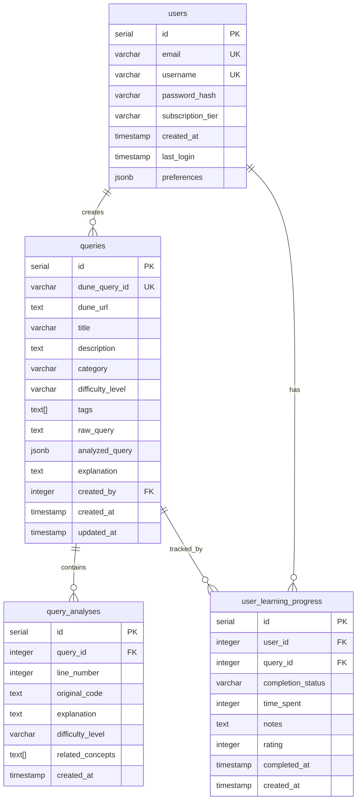

# 🔧 기술 명세서 (Technical Specification)

## 📋 개요

Dune Query Analyzer & Learning Platform의 기술적 구현 세부사항을 정의합니다.

## 🏗️ 시스템 아키텍처

### 전체 아키텍처

```
┌─────────────────┐    ┌─────────────────┐    ┌─────────────────┐
│   Frontend      │    │    Backend      │    │   Database      │
│   (React)       │◄──►│   (Node.js)     │◄──►│  (PostgreSQL)   │
└─────────────────┘    └─────────────────┘    └─────────────────┘
         │                       │                       │
         │                       │                       │
         ▼                       ▼                       ▼
┌─────────────────┐    ┌─────────────────┐    ┌─────────────────┐
│   CDN           │    │   Redis Cache   │    │   File Storage  │
│   (Vercel)      │    │   (Upstash)     │    │   (AWS S3)      │
└─────────────────┘    └─────────────────┘    └─────────────────┘
```

### 마이크로서비스 구조 (향후 확장)

```
┌─────────────────┐    ┌─────────────────┐    ┌─────────────────┐
│  API Gateway    │    │  Auth Service   │    │  Query Service  │
│   (Kong)        │    │   (JWT)         │    │  (Analysis)     │
└─────────────────┘    └─────────────────┘    └─────────────────┘
         │                       │                       │
         │                       │                       │
         ▼                       ▼                       ▼
┌─────────────────┐    ┌─────────────────┐    ┌─────────────────┐
│  User Service   │    │ Learning Service│    │  AI Service     │
│   (Profile)     │    │   (Progress)    │    │  (Claude)       │
└─────────────────┘    └─────────────────┘    └─────────────────┘
```

## 🎯 기술 스택 상세

### Frontend

#### 핵심 기술
- **React 18**: 최신 React 기능 활용 (Concurrent Features, Suspense)
- **TypeScript 5.0+**: 타입 안정성 및 개발자 경험 향상
- **Vite**: 빠른 개발 서버 및 빌드 도구

#### 상태 관리
- **Zustand**: 가벼운 상태 관리 라이브러리
- **React Query**: 서버 상태 관리 및 캐싱
- **React Hook Form**: 폼 상태 관리

#### UI/UX 라이브러리
- **Tailwind CSS**: 유틸리티 퍼스트 CSS 프레임워크
- **Framer Motion**: 애니메이션 라이브러리
- **React CodeMirror**: 코드 에디터 컴포넌트
- **Recharts**: 차트 및 데이터 시각화

#### 개발 도구
- **ESLint**: 코드 품질 관리
- **Prettier**: 코드 포맷팅
- **Husky**: Git 훅 관리
- **Vitest**: 단위 테스트

### Backend

#### 핵심 기술
- **Node.js 18+**: LTS 버전 사용
- **Express.js**: 웹 프레임워크
- **TypeScript**: 타입 안정성
- **Fastify**: 고성능 웹 프레임워크 (대안)

#### 데이터베이스
- **PostgreSQL 14+**: 메인 데이터베이스
- **Redis 6+**: 캐싱 및 세션 저장
- **Prisma**: ORM 및 마이그레이션
- **TypeORM**: 대안 ORM

#### 인증 및 보안
- **JWT**: 토큰 기반 인증
- **bcrypt**: 비밀번호 해싱
- **helmet**: 보안 헤더 설정
- **rate-limiter**: API 요청 제한

#### API 문서화
- **Swagger/OpenAPI**: API 문서 자동 생성
- **Postman**: API 테스트 및 문서화

### DevOps & Infrastructure

#### 배포
- **Docker**: 컨테이너화
- **Docker Compose**: 로컬 개발 환경
- **Vercel**: 프론트엔드 배포
- **Railway/Render**: 백엔드 배포

#### 모니터링
- **Sentry**: 에러 추적
- **LogRocket**: 사용자 세션 녹화
- **Uptime Robot**: 가용성 모니터링

#### CI/CD
- **GitHub Actions**: 자동화 파이프라인
- **ESLint**: 코드 품질 검사
- **Jest**: 테스트 자동화

## 📊 데이터베이스 설계

### ERD (Entity Relationship Diagram)



### 인덱스 전략

```sql
-- 성능 최적화를 위한 인덱스
CREATE INDEX idx_queries_category ON queries(category);
CREATE INDEX idx_queries_difficulty ON queries(difficulty_level);
CREATE INDEX idx_queries_tags ON queries USING GIN(tags);
CREATE INDEX idx_queries_created_at ON queries(created_at DESC);
CREATE INDEX idx_user_progress_user_id ON user_learning_progress(user_id);
CREATE INDEX idx_user_progress_status ON user_learning_progress(completion_status);
CREATE INDEX idx_query_analyses_query_id ON query_analyses(query_id);
```

## 🔌 API 설계

### RESTful API 엔드포인트

#### 인증 API
```typescript
// POST /api/auth/register
interface RegisterRequest {
  email: string;
  username: string;
  password: string;
}

// POST /api/auth/login
interface LoginRequest {
  email: string;
  password: string;
}

// POST /api/auth/refresh
interface RefreshRequest {
  refreshToken: string;
}

// POST /api/auth/logout
interface LogoutRequest {
  refreshToken: string;
}
```

#### 쿼리 분석 API
```typescript
// POST /api/analyze
interface AnalyzeRequest {
  duneUrl: string;
  userId?: number;
}

// GET /api/analyze/:id
interface AnalyzeResponse {
  id: string;
  duneQueryId: string;
  title: string;
  description: string;
  rawQuery: string;
  analyses: QueryAnalysis[];
  difficulty: string;
  category: string;
  tags: string[];
  createdAt: string;
}

// GET /api/analyze/:id/explanation
interface ExplanationResponse {
  lineNumber: number;
  originalCode: string;
  explanation: string;
  difficulty: string;
  relatedConcepts: string[];
}
```

#### 쿼리 관리 API
```typescript
// GET /api/queries
interface QueriesRequest {
  page?: number;
  limit?: number;
  category?: string;
  difficulty?: string;
  tags?: string[];
  search?: string;
  sortBy?: 'created_at' | 'title' | 'difficulty';
  sortOrder?: 'asc' | 'desc';
}

// POST /api/queries
interface CreateQueryRequest {
  duneQueryId: string;
  duneUrl: string;
  title: string;
  description?: string;
  category: string;
  difficultyLevel: string;
  tags: string[];
  rawQuery: string;
  analyzedQuery: any;
  explanation: string;
}

// PUT /api/queries/:id
interface UpdateQueryRequest {
  title?: string;
  description?: string;
  category?: string;
  difficultyLevel?: string;
  tags?: string[];
  explanation?: string;
}
```

#### 학습 진행 API
```typescript
// GET /api/learning/progress
interface ProgressRequest {
  userId: number;
  page?: number;
  limit?: number;
  status?: string;
}

// POST /api/learning/progress
interface UpdateProgressRequest {
  userId: number;
  queryId: number;
  completionStatus: 'not_started' | 'in_progress' | 'completed';
  timeSpent?: number;
  notes?: string;
  rating?: number;
}

// GET /api/learning/recommendations
interface RecommendationsRequest {
  userId: number;
  limit?: number;
  category?: string;
  difficulty?: string;
}
```

### GraphQL API (향후 확장)

```graphql
type Query {
  queries(
    page: Int
    limit: Int
    category: String
    difficulty: String
    tags: [String!]
    search: String
  ): QueryConnection!
  
  query(id: ID!): Query
  userProgress(userId: ID!): [UserProgress!]!
  recommendations(userId: ID!): [Query!]!
}

type Mutation {
  analyzeQuery(duneUrl: String!): AnalyzeResult!
  updateProgress(input: UpdateProgressInput!): UserProgress!
  createQuery(input: CreateQueryInput!): Query!
}

type Query {
  id: ID!
  duneQueryId: String!
  title: String!
  description: String
  category: String!
  difficultyLevel: String!
  tags: [String!]!
  rawQuery: String!
  analyses: [QueryAnalysis!]!
  createdAt: DateTime!
  updatedAt: DateTime!
}

type QueryAnalysis {
  id: ID!
  lineNumber: Int!
  originalCode: String!
  explanation: String!
  difficulty: String!
  relatedConcepts: [String!]!
}
```

## 🔐 보안 설계

### 인증 및 권한

#### JWT 토큰 구조
```typescript
interface JWTPayload {
  userId: number;
  email: string;
  username: string;
  subscriptionTier: string;
  permissions: string[];
  iat: number;
  exp: number;
}

interface RefreshToken {
  userId: number;
  tokenId: string;
  expiresAt: Date;
}
```

#### 권한 시스템
```typescript
enum Permission {
  READ_QUERIES = 'read:queries',
  WRITE_QUERIES = 'write:queries',
  DELETE_QUERIES = 'delete:queries',
  ANALYZE_QUERIES = 'analyze:queries',
  MANAGE_USERS = 'manage:users',
  ADMIN = 'admin'
}

enum Role {
  FREE_USER = 'free_user',
  PREMIUM_USER = 'premium_user',
  ADMIN = 'admin'
}
```

### 데이터 보안

#### 암호화
```typescript
// 비밀번호 해싱
const hashPassword = async (password: string): Promise<string> => {
  const saltRounds = 12;
  return bcrypt.hash(password, saltRounds);
};

// 민감 데이터 암호화
const encryptSensitiveData = (data: string): string => {
  const algorithm = 'aes-256-gcm';
  const key = crypto.scryptSync(process.env.ENCRYPTION_KEY!, 'salt', 32);
  const iv = crypto.randomBytes(16);
  const cipher = crypto.createCipher(algorithm, key);
  // ... 암호화 로직
};
```

#### API 보안
```typescript
// Rate Limiting
const rateLimit = rateLimit({
  windowMs: 15 * 60 * 1000, // 15분
  max: 100, // IP당 최대 요청 수
  message: '너무 많은 요청이 발생했습니다.'
});

// CORS 설정
const corsOptions = {
  origin: process.env.ALLOWED_ORIGINS?.split(','),
  credentials: true,
  optionsSuccessStatus: 200
};

// Helmet 보안 헤더
app.use(helmet({
  contentSecurityPolicy: {
    directives: {
      defaultSrc: ["'self'"],
      styleSrc: ["'self'", "'unsafe-inline'"],
      scriptSrc: ["'self'"],
      imgSrc: ["'self'", "data:", "https:"],
    },
  },
}));
```

## 📈 성능 최적화

### 캐싱 전략

#### Redis 캐싱
```typescript
// 쿼리 분석 결과 캐싱
const cacheQueryAnalysis = async (queryId: string, analysis: any) => {
  const key = `analysis:${queryId}`;
  await redis.setex(key, 3600, JSON.stringify(analysis)); // 1시간 캐시
};

// 사용자 세션 캐싱
const cacheUserSession = async (userId: number, session: any) => {
  const key = `session:${userId}`;
  await redis.setex(key, 86400, JSON.stringify(session)); // 24시간 캐시
};
```

#### 프론트엔드 캐싱
```typescript
// React Query 캐싱 설정
const queryClient = new QueryClient({
  defaultOptions: {
    queries: {
      staleTime: 5 * 60 * 1000, // 5분
      cacheTime: 10 * 60 * 1000, // 10분
      retry: 3,
      refetchOnWindowFocus: false,
    },
  },
});
```

### 데이터베이스 최적화

#### 쿼리 최적화
```sql
-- 복합 인덱스
CREATE INDEX idx_queries_category_difficulty ON queries(category, difficulty_level);

-- 부분 인덱스
CREATE INDEX idx_queries_active ON queries(id) WHERE deleted_at IS NULL;

-- 표현식 인덱스
CREATE INDEX idx_queries_title_lower ON queries(LOWER(title));
```

#### 연결 풀링
```typescript
// PostgreSQL 연결 풀 설정
const pool = new Pool({
  host: process.env.DB_HOST,
  port: parseInt(process.env.DB_PORT!),
  database: process.env.DB_NAME,
  user: process.env.DB_USER,
  password: process.env.DB_PASSWORD,
  max: 20, // 최대 연결 수
  idleTimeoutMillis: 30000, // 유휴 타임아웃
  connectionTimeoutMillis: 2000, // 연결 타임아웃
});
```

### 프론트엔드 최적화

#### 코드 스플리팅
```typescript
// 라우트 기반 코드 스플리팅
const QueryAnalyzer = lazy(() => import('./pages/QueryAnalyzer'));
const LearningDashboard = lazy(() => import('./pages/LearningDashboard'));
const QueryRepository = lazy(() => import('./pages/QueryRepository'));

// 컴포넌트 기반 코드 스플리팅
const CodeEditor = lazy(() => import('./components/CodeEditor'));
const ChartComponent = lazy(() => import('./components/ChartComponent'));
```

#### 이미지 최적화
```typescript
// Next.js Image 컴포넌트 사용
import Image from 'next/image';

<Image
  src="/logo.png"
  alt="Logo"
  width={200}
  height={100}
  priority
  placeholder="blur"
  blurDataURL="data:image/jpeg;base64,..."
/>
```

## 🧪 테스트 전략

### 테스트 피라미드

```
        E2E Tests (10%)
           ▲
    Integration Tests (20%)
           ▲
    Unit Tests (70%)
```

### 단위 테스트
```typescript
// Jest + React Testing Library
describe('QueryAnalyzer', () => {
  it('should analyze Dune query correctly', async () => {
    const mockQuery = 'SELECT * FROM ethereum.transactions';
    const { getByText, findByText } = render(<QueryAnalyzer />);
    
    fireEvent.change(getByTestId('query-input'), {
      target: { value: mockQuery }
    });
    
    fireEvent.click(getByText('분석하기'));
    
    await findByText('분석 완료');
    expect(getByText('SELECT')).toBeInTheDocument();
  });
});
```

### 통합 테스트
```typescript
// API 엔드포인트 테스트
describe('POST /api/analyze', () => {
  it('should return analysis result', async () => {
    const response = await request(app)
      .post('/api/analyze')
      .send({
        duneUrl: 'https://dune.com/queries/123'
      })
      .expect(200);
    
    expect(response.body).toHaveProperty('id');
    expect(response.body).toHaveProperty('analyses');
  });
});
```

### E2E 테스트
```typescript
// Playwright
test('complete query analysis flow', async ({ page }) => {
  await page.goto('/analyzer');
  await page.fill('[data-testid="query-input"]', 'SELECT * FROM ethereum.transactions');
  await page.click('[data-testid="analyze-button"]');
  await page.waitForSelector('[data-testid="analysis-result"]');
  
  const result = await page.textContent('[data-testid="analysis-result"]');
  expect(result).toContain('분석 완료');
});
```

## 📊 모니터링 및 로깅

### 로깅 시스템
```typescript
// Winston 로거 설정
const logger = winston.createLogger({
  level: 'info',
  format: winston.format.combine(
    winston.format.timestamp(),
    winston.format.json()
  ),
  transports: [
    new winston.transports.File({ filename: 'error.log', level: 'error' }),
    new winston.transports.File({ filename: 'combined.log' })
  ]
});

// 구조화된 로깅
logger.info('Query analysis completed', {
  queryId: '123',
  userId: '456',
  duration: 1500,
  success: true
});
```

### 성능 모니터링
```typescript
// API 응답 시간 측정
app.use((req, res, next) => {
  const start = Date.now();
  res.on('finish', () => {
    const duration = Date.now() - start;
    logger.info('API request completed', {
      method: req.method,
      url: req.url,
      statusCode: res.statusCode,
      duration
    });
  });
  next();
});
```

### 에러 추적
```typescript
// Sentry 설정
Sentry.init({
  dsn: process.env.SENTRY_DSN,
  environment: process.env.NODE_ENV,
  tracesSampleRate: 1.0,
});

// 에러 핸들링
app.use((error: Error, req: Request, res: Response, next: NextFunction) => {
  Sentry.captureException(error);
  logger.error('Unhandled error', { error: error.message, stack: error.stack });
  res.status(500).json({ error: 'Internal server error' });
});
```

## 🚀 배포 전략

### Docker 설정
```dockerfile
# Frontend Dockerfile
FROM node:18-alpine AS builder
WORKDIR /app
COPY package*.json ./
RUN npm ci --only=production
COPY . .
RUN npm run build

FROM nginx:alpine
COPY --from=builder /app/dist /usr/share/nginx/html
COPY nginx.conf /etc/nginx/nginx.conf
EXPOSE 80
CMD ["nginx", "-g", "daemon off;"]
```

```dockerfile
# Backend Dockerfile
FROM node:18-alpine
WORKDIR /app
COPY package*.json ./
RUN npm ci --only=production
COPY . .
EXPOSE 3000
CMD ["npm", "start"]
```

### CI/CD 파이프라인
```yaml
# GitHub Actions
name: Deploy
on:
  push:
    branches: [main]

jobs:
  test:
    runs-on: ubuntu-latest
    steps:
      - uses: actions/checkout@v3
      - uses: actions/setup-node@v3
        with:
          node-version: '18'
      - run: npm ci
      - run: npm test
      - run: npm run lint

  deploy:
    needs: test
    runs-on: ubuntu-latest
    steps:
      - uses: actions/checkout@v3
      - name: Deploy to Vercel
        uses: amondnet/vercel-action@v20
        with:
          vercel-token: ${{ secrets.VERCEL_TOKEN }}
          vercel-org-id: ${{ secrets.ORG_ID }}
          vercel-project-id: ${{ secrets.PROJECT_ID }}
```

이 기술 명세서를 기반으로 체계적이고 확장 가능한 시스템을 구축할 수 있습니다.
